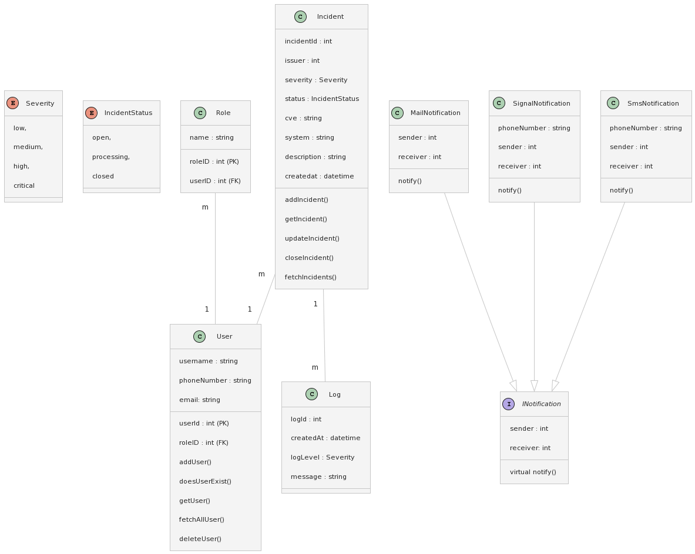

# SIMS - Security Incident Management System

**Version:** 1.0

## Inhaltsverzeichnis
- [Beschreibung](#beschreibung)
- [Systemanforderungen](#systemanforderungen)
- [Installation](#installation)
- [Verwendung](#verwendung)
- [ER-Diagramm](#er-diagramm)
- [Klassendiagramm](#klassendiagramm)
- [Semgrep Results](#semgrep-results)

## Beschreibung
Das "Security Incident Management System" (SIMS) ist ein Tool zur Protokollierung von IT-Sicherheitsvorfällen. Es ermöglicht Benutzern das Erfassen, Eskalieren und Benachrichtigen von sicherheitsrelevanten Vorfällen.

**Features:**

📝 - **Manuelle Erfassung**: Sicherheitsrelevante Vorfälle können detailreich (Bearbeiter, Melder, Schweregrad, Status, CVE, System, Beschreibung, Zeitstempel) erfasst werden.

⏫ - **Eskalation**: Automatische Weiterleitung an den nächsten Benutzer.

🔔 - **Notifizierung**: Benachrichtigungen über verschiedene Kanäle wie SMS und Signal.

👥 - **Benutzerverwaltung**: Unterschiedliche Rollen (Administratoren, Benutzer) ermöglichen eine gezielte Zugriffskontrolle.

📊 - **Protokollierung**: Alle Vorfälle werden in einer übersichtlichen Log-Tabelle gespeichert.

🗃️ - **Datenbankspeicherung**: Ein relationales Datenbanksystem speichert Vorfälle, Benutzerdaten und Logs.

## Systemanforderungen

### Software
- Betriebssystem: Windows 10+, Linux
- .NET-Runtime: .NET 7.0

### Tools
- Docker: Erforderlich, um die Anwendung und die Datenbank in Containern bereitzustellen
- Docker-compose: Tool zur Definition und zum Laufen multi-container Docker Anwendungen.

## Installation
1. Klonen Sie das Git-Repository: [Link zum Repository](https://github.com/IhrBenutzername/sims)

Folgenden Befehl ausführen: ``docker-compose up -d``

## Verwendung
1. Starten Sie die Anwendung.
2. Wählen Sie aus den angebotenen Optionen, um Vorfälle anzuzeigen, hinzuzufügen, zu bearbeiten, zu schließen oder das Programm zu beenden.

## Roadmap
1. **Initialisierung**
    - Projektstart
    - Systemarchitektur
    - Datenbankmodellierung

2. **Hauptfeatures**
    - Manuelle Erfassung
    - Eskalationsmechanismus
    - Notifizierungs-Integration
        - SMS
        - Signal
    - Benutzerverwaltung
        - Administratoren
        - Benutzer
    - Protokollierung

3. **Zukünftige Features**
    - Automatische Threat-Erkennung
    - Dashboards und Berichte
    - Integration von Drittanbieter-Security-Tools
    - Cloud-Sicherheitsmaßnahmen
    - Mobile App Entwicklung
    - Fortgeschrittene Analysetools

## ER-Diagramm

## Klassendiagramm

## Semgrep Results
| Key            | Value                                                                                                                                                                                                                                                                                                                   |
| -------------- | ----------------------------------------------------------------------------------------------------------------------------------------------------------------------------------------------------------------------------------------------------------------------------------------------------------------------- |
| errors         | []                                                                                                                                                                                                                                                                                                                       |
| paths (scanned)| [".vs", "Classes/Escalation.cs", "Classes/Incident.cs", "Classes/Log.cs", "Classes/MailNotification.cs", "Classes/Role.cs", "Classes/SignalNotification.cs", "Classes/SmsNotification.cs", "Classes/User.cs", "Database/IncidentContext.cs", "Dockerfile", "Enums/IncidentStatus.cs", "Enums/MenuOption.cs", "Enums/Severity.cs", "Interfaces/INotification.cs", "Migrations/20231019151822_InitialCreate.Designer.cs", "Migrations/20231019151822_InitialCreate.cs", "Migrations/IncidentContextModelSnapshot.cs", "Program.cs", "acdt-project.csproj", "docker-semgrep.sh", "scan_results.json", "scan_results.txt", "trigger.sql"] |
| results        | []                                                                                                                                                                                                                                                                                                                       |
| skipped_rules  | []                                                                                                                                                                                                                                                                                                                       |
| version        | "1.45.0"                                                                                                                                                                                                                                                                                                                 |

Dieses Projekt steht unter der [MIT-Lizenz](https://opensource.org/licenses/MIT).